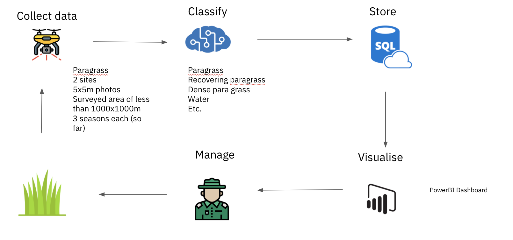
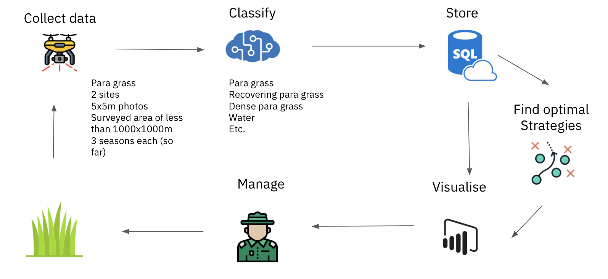
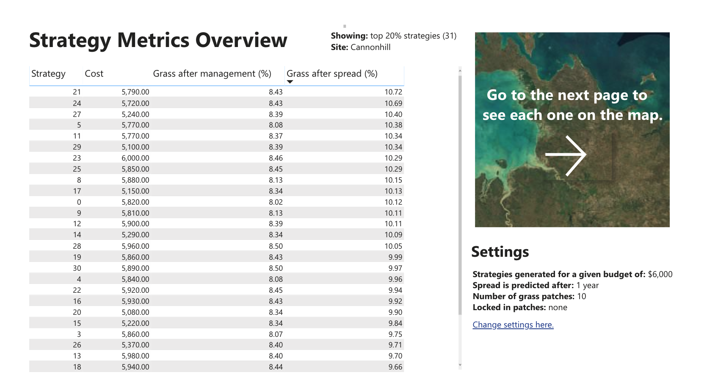
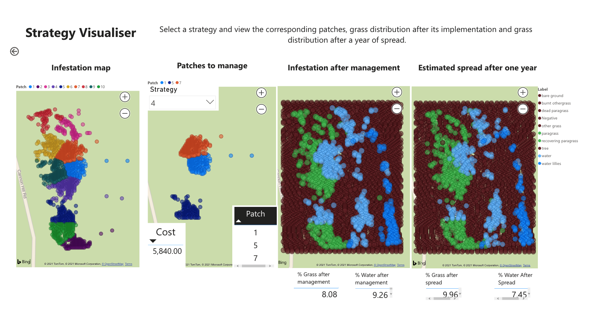
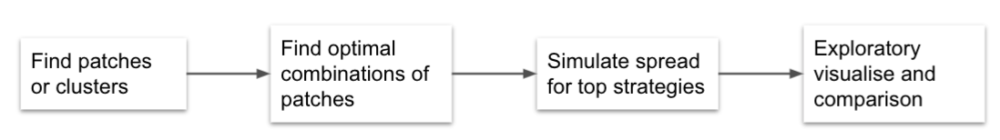

# Strategy Planner

## Healthy Country AI Strategy Planner: an AI-enabled decision support system for prioritising invasive weed actions on Indigenous lands

## Overview

This is an extension of the [Healthy Country AI system](https://github.com/microsoft/HealthyCountryAI).  The Healthy Country AI system is an AI-enabled system that collects, classifies, stores and visualises high-quality data on invasive weeds in Kakadu according to indigenous governance protocols. This system builds upon that work to help turn that data into actions by allowing rangers to make informed weed control prioritisation decisions.






## Requirement mapping 


## **Functionality**

Our methodology has four steps: data clustering, generation and ranking of strategies, spread simulation and interactive visualisation.  We implemented this functionality as an open-source Python package strategyplanner, integrated into the Healthy Country AI pipeline and an interactive dashboard. 
Our frameworks build on more than a decade of work in the integration of indigenous knowledge in conservation planning and prioritisation in Australia (Robinson et al. 2012; Adams et al 2015a; Adams et al 2015b). In particular, this tool is intended for use in a systematic conservation planning scenario, when making decisions about weed management (Margules & Pressey, 2000). 

The aim of this tool is not to prescribe but to inform decision making on the basis of resource optimisation. 

**Data**

Our data comes from photos collected by drones and labeled by a computer vision algorithm at a resolution of 5 meters in 3 different sites within Kakadu National Park (Robinson et al. in review). This application case will focus on one of the sites on the Nardab floodplain, which has dimensions of 700x425m, or 140x85 grid cells, for a total of 11,900 cells. The photos were captured on 2019-10-29 corresponding to the Kunumeleng season. There are 10 possible labels for each cell: water, water lillies, bare ground, tree, other grass, burnt othergrass, dead paragrass, recovering paragrass, paragrass, dense paragrass. The Healthy Country AI Strategy Planner connects to this data remotely through the Open Database Connectivity (ODBC) interface and the Python package pyodbc (https://github.com/mkleehammer/pyodbc). 
We define cost and gain metrics for each of the cells depending on the density of grass. In terms of cost, we reflect monetary cost management proportional to the grass density. In terms of gain, we define it in terms of amount of grass killed, and we set it as proportional to grass density as well.

**Data clustering**

Our data has a spatial resolution of 5x5 meters. This is too granular for weed management and planning in the Kakadu wetlands, which is done at the larger patch scales. Therefore, the first step is to automatically group the data into these patches. We use the k-means unsupervised clustering algorithm using scikit-learn (Pedregosa 2012). K-means requires a number of clusters passed as a parameter. We assume an approximate average patch size of 3,000 m2, thus we end up with 10 clusters. These patches will be our planning units. For each one, we sum the cost and gains of individual cells.

**Strategy generation and ranking**

We define strategies as a combination of patches that are scheduled for chemical treatment. Initially, we tested the stochastic optimisation algorithms to generate solutions used in other prioritisation approaches (i.e. Possingham, 2009). These methods are useful when the search space is large. However, we are working at a scale with few planning units thus the search space is not large enough to grant the use of complex optimisation models. Instead, we can generate all possible combinations and rank them deterministically.
Our algorithm tries all the combinations of n patches, where n >= 1 and n < P, and P is total patches. There are 1023 possible such combinations. We select only those that have a total cost below the given budget. These leaves us with 155 possible solutions. We then select the top 20% of these in terms of total gain. 

**Spread simulation**

For each of the top 20% management strategies, we simulate subsequent spread for one year using a cellular automata model developed by Adams et al (2015). The spread model works as follows: each infested cell can spread if it has reached reproductive stage, that is, if it has been infested for more than a given wait time, W. Each cell that spreads produces a given number of offspring, r. For each of the r offspring, we move from the spreader cell in direction d for a distance D given in number of cells. Upon landing on a cell, a spread event occurs according to a probability of establishment defined for each cell label.

**Visualisation Dashboard**
The results of the previous step populate an SQL database, which in turn feeds a dashboard where the user can compare strategies and derive insights to inform on the ground weed management. The dashboard is divided in three sections: Introduction page, Strategy Metrics Overview and Strategy Visualiser. 
The purpose of the introduction page is providing clarity about what the tool is doing, and inviting the user to engage with the tool as an informative device rather than a descriptive one. 
In the strategy metrics the user can see, for each of the top 20% strategies: the cost, the percentage of grass after management, and the percentage of grass after spread. The user can rank the according to each one of this metrics, and go to the next page to visualise in a map each specific strategy implementation.
In this page, the user can see to the left a map of the infestation grouped by patches. The user can select a strategy based on the previous page rankings and see which patches are managed in that strategy. The user can then see how the infestation map would look after management, as well as an estimation of the spread after one year from the strategy's implementation.





#### Insert image of dashboard here

## How to run this code

As mentioned above, the code performs the following pipeline.



At the core of Strategy Planner is the strategyPlanner function. 

```python
strategyPlanner(label_grid, invasive_number_label, cost_grid, benefit_grid, max_cost, n_patches)
```

**Parameters** 

label_grid: 2D numpy array of integers
    This is the infestation data. It needs to be a 2d array where each cell is an observation with a label attached. The array must contain a number in each position. Each different number represents a different label. In Healthy Country AI, each entry in the array represents a 5x5m photo with a numeric label representing the following labels. Ideally, set up up so that this can capture a cardinality in infestation density. Negatives denotes parts that are not part of the map but were included for symmetry, usually in the outskirts.
    - 'Negative' = 0
     - 'water' = 1
     - 'water lillies' = 2
     - 'bare ground' = 3
     - 'tree' = 4
     - 'other grass' = 5
     - 'burnt othergrass' = 6
     - 'dead paragrass' = 7
     - 'recovering paragrass' = 8
     - 'paragrass' = 9
     - 'dense paragrass' = 10

invasive_number_label: integer
      All of the numbers above and including this one will be considered as part of the infestation. This will be considered in the management optimisation and in the spreading. In the case of Healthy Country AI, this number is 8. If you had an infestation grid with only one infestation label or class, define that label as the highest number. For example, if you had 5 classes, you would assign the infestation label the number 5, and your invasive_number_label would be 5. Zero (0) is used for a label that does not matter used for filling the data. 
      
 cost_grid: 2D numpy array of integers
An array with the same dimensions as label_grid, but that instead of having an int as a label, it has a float value indicating cost of managing each cell. If all cells of a particular label have the same cost, you can use your label grid to create the cost grid. For example, to define all cells of class 8 as having a cost of 10, you could do the following.

```
splanner = cost_grid[:,:][np.where(label_grid == 8)] = 10
```

benefit_grid: 2D numpy array of integers
Similar to cost_grid, but where each entry denotes benefit of managing that cell. If all cells in a class give same gain, you can something similar as the code above to define it.

max_cost: float
The maximum cost or budget. All strategies generated must be below this number. 

n_patches: int, units in number of cells. 
How many cells do you estimate are in every patch. A patch is the planning unit, the minimum unit of managementing planning and action. For Healthy Country AI, this is 140, thus dividing that by the total number of infested cells, we end up with 10 patches. 

**Returns**

A strategyPlanner object


Once you have created the strategyPlanner, you can run the optimise function. 

```
splanner.optimise()
```

**Returns**

A results object, which currently is a dictionary of number of solutions. Each solution has the following values: values:

'Solution Number': an identifier 
'Managed Grid': a grid of the same shape as label_grid, with labels that denote as state of infestation immediately after management. If this strategy is implemented, this is how the ingestation would like. 
'Spreaded Grid':  a grid of the same shape as label_grid, with labels that denote as state of infestation after spread has been modelling. That is, in a longer term than Managed Grid. The period into the future for which spread is modelled depends on the parameters passed to the spread() function detailed below.
'Metrics after management': this is itself made of a dictionary that contains:
'Percentage grass': a float value denoting grass left after a strategy was implemented.
'Percentage water': a float value denoting water left immediatelly after the strategy has been implemented.
'Cost': a float value denoting cost for this strategy
       'Metrics after spread': similar to the one above, but with metrics for the infestation after spread has been modelled in the future. 
'Percentage grass': a float value denoting grass left after a strategy has been implemented and a period of time has happened that allowed the grass to spread.
'Percentage water': a float value denoting water left after a strategy has been implemented and a period of time has happened that allowed the grass to spread


At the moment, the optimise function runs the whole pipeline, clustering, strategy generation and ranking, spread simulation as well as evaluation of results to produce the results object. However, I am working on separating these in individual functions to modularise so for example, a different optimisation algorithm can be used but using the same clustering and simulation, and also to create modular custom pipelines. 

I still briefly describe each of the functions currently run within optimise:

**Clusterize**

```
clusterize()
```

This function currently is running k-means and uses the number of patches calculated from the estimated average size of patches.

**Spread**

```
spread(grid, time_since_infested , wait_time: int, rate: int, distance: int, direction: tuple, suitability_by_label: list ) -> list
```

In the future, this will be a stand alone function and would be able to run it with custom parameters from the strategyPlanner object. However, currently is being run inside optimise. If you want to change how the spread model works you just need to change the parameters here changing the optimise() function. Currently, we are running a spread algorithm based on Adams et al. (2015) See the paper to understand the spread parameters better.

Parameters: 

 time_since_infested: 2d numpy array
 grid of same shape and size as label_grid, where each entry indicates how long that cell has been infested for. Since a cell can only spread after a given wait time specific to the species, we need this value. 
 wait_time: int
Amount of years it has to pass for a cell to be able to spread. 
 rate: int
Number of offspring produced by each cell
 distance: int
Distance given in cell lengths indicating how long an offspring travels
 direction: tuple
A tuple of 2 values that indicates direction of spread cardinally going from (-1,1). For example, (1,1) says direction is top left, or north east. -1,1 says direction is top right or north west. (-1,-1) says direction is bottom right, or south west, and so one. (0,0) says no direction and we just spread in random directions samples from a uniform distribution.
 suitability_by_label: list
a list where each position corresponds to a value in the label_grid. Contains decimal values from 0 to 1, indicating the probability that an offspring establishes if it lands on this cell label or class. Probably should change this to be a grid to be consistent with benefit_grid_ cost_grid and label_grid, because potentially probability is not only a function of label but also of position in the grid. 
 
 
**Evaluation**

```
EvaluateGrid(solution):
````

Parameters:
 solution: grid of same length and size as label grid. 

Returns: a dictionary with the following values:

'Percentage grass': a float value denoting grass left after a strategy was implemented.
'Percentage water': a float value denoting water left immediatelly after the strategy has been implemented.
'Cost': a float value denoting cost for this strategy

**References**

Adams, V. M., Petty, A. M., Douglas, M. M., Buckley, Y. M., Ferdinands, K. B., Okazaki, T., Ko, D. W., & Setterfield, S. A. (2015). Distribution, demography and dispersal model of spatial spread of invasive plant populations with limited data. Methods in Ecology and Evolution, 6(7), 782–794. https://doi.org/10.1111/2041-210X.12392

Broad, E. (2020). System Goals and Boundaries [Power Point Slides]. CECS6002: Cybernetics Practice for Cyberphysical Systems, Australian National University.

Ball I.R., Possingham H.P., Watts M. (2009) Marxan and relatives: Software for spatial conservation prioritisation. pp. 185-195 in A. Moilanen, K.A. Wilson, H.P. Possingham editors. Chapter 14 in Spatial conservation prioritisation: Quantitative methods and computational tools. Oxford University Press, Oxford, UK.

CSIRO. (2019). AI transforms Kakadu management. CSIRO. Retrieved February 26, 2021, from https://www.csiro.au/en/News/News-releases/2019/AI-transforms-Kakadu-management

Healthy Country AI. (2019). ReadMe Document. GitHub. Retrieved February 26, 2021, from https://github.com/microsoft/HealthyCountryAI

Margules, C. R., & Pressey, R. L. (2000). Systematic conservation planning. Nature, 405(6783), 243–253. https://doi.org/10.1038/35012251

